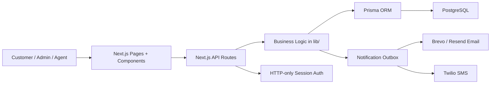
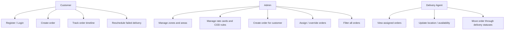
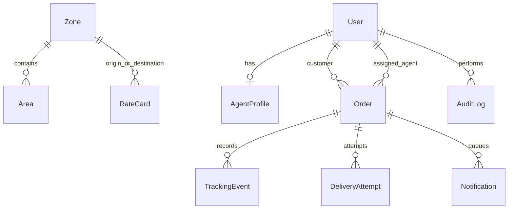
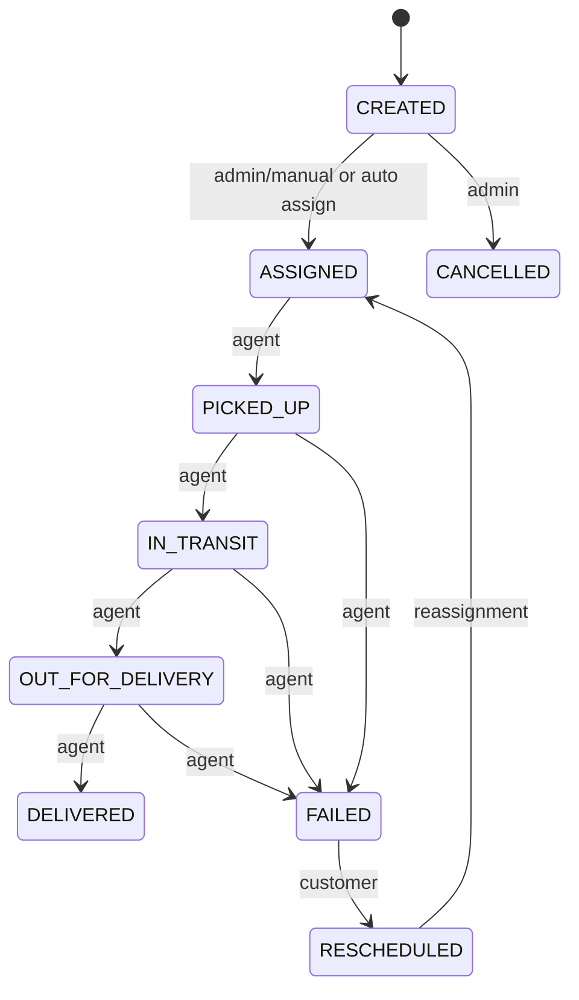
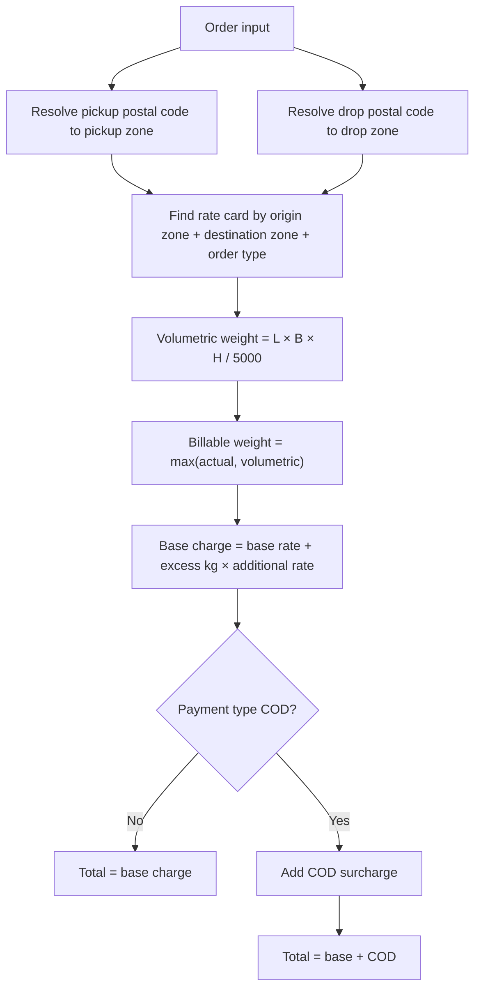
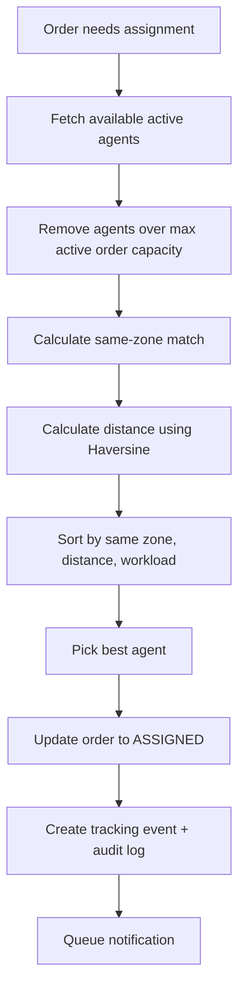
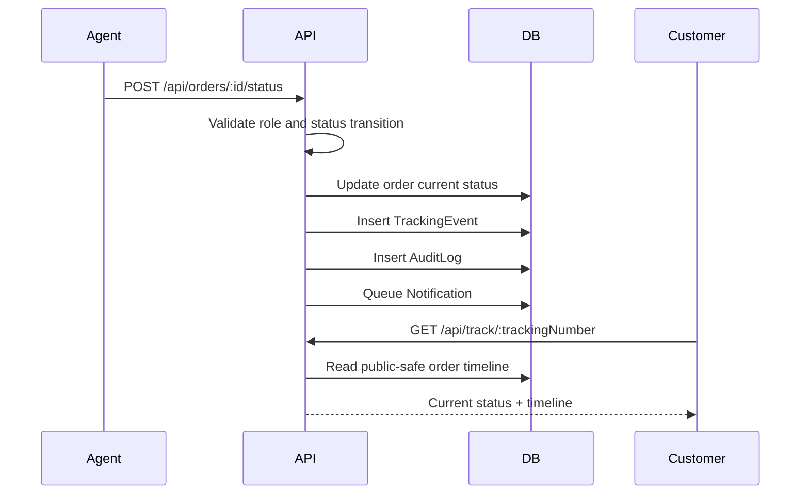
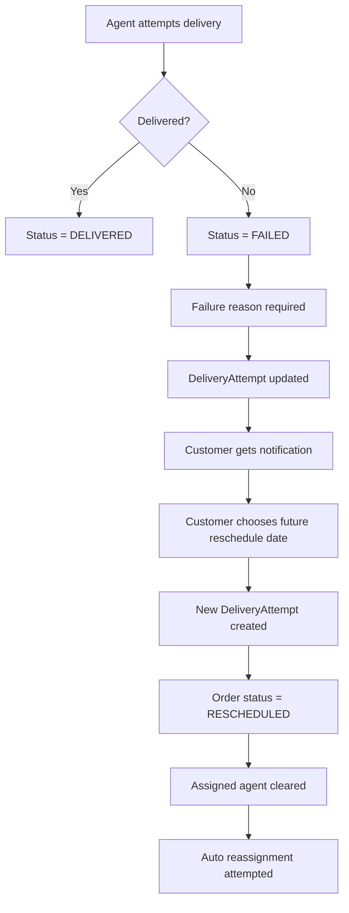
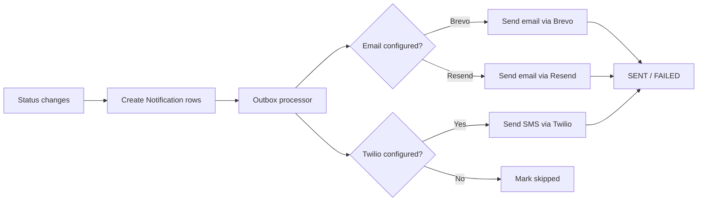
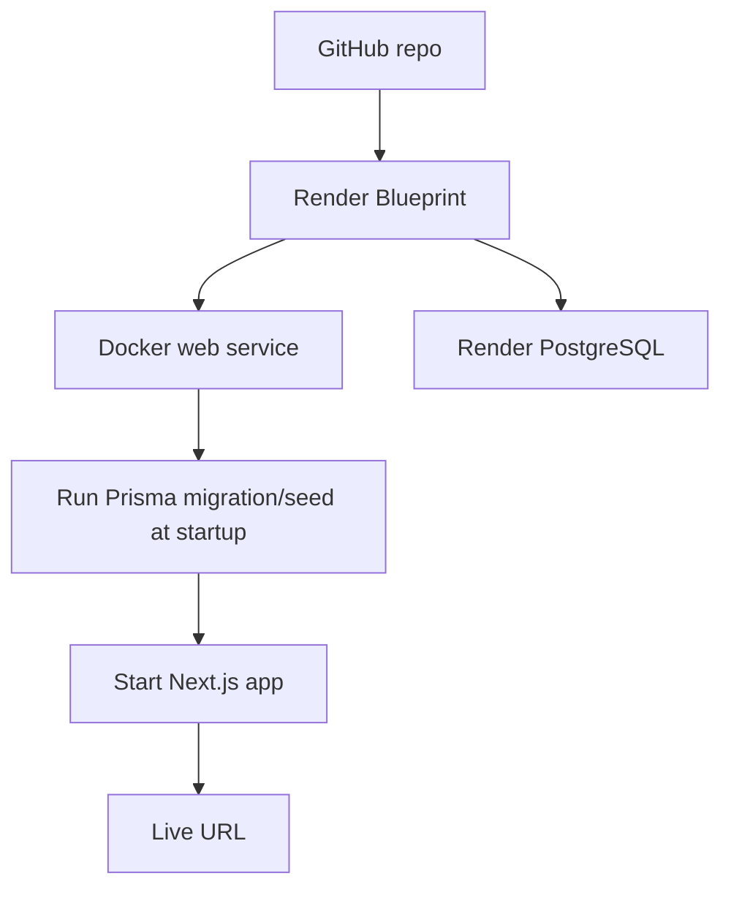

# Last-Mile Delivery Tracker — Assignment + Interview Guide

Use this as your single revision file before the onsite round. It explains what the assignment asked, what this project does, how the main logic works, and how to answer questions confidently.

Repo: https://github.com/D-393Patel/last-mile-delivery-tracker  
Live app: https://last-mile-delivery-tracker-lm8c.onrender.com  
Demo tracking number: `LMD260630DEMO01`

## 1. One-minute project explanation

I built a full-stack Last-Mile Delivery Tracker for managing pickup-to-delivery operations. It has three roles: customer, admin, and delivery agent. Customers can register, create delivery orders, see calculated charges, and track the complete order timeline. Admins can manage service zones, areas, rate cards, COD rules, agents, assignments, and order statuses. Agents can see assigned orders and update delivery progress.

The core business logic includes zone-based pricing, volumetric vs actual weight calculation, COD surcharge, intelligent delivery-agent assignment, immutable tracking history, failed-delivery rescheduling, and email/SMS notifications. The app is built with Next.js, TypeScript, PostgreSQL, Prisma, and Docker, and deployed on Render.

## 2. What the assignment required vs what was built

| Assignment requirement | Implementation in project |
|---|---|
| Customer login/register | Customer auth with session cookies |
| Admin and agent roles | Role-based access control: `CUSTOMER`, `ADMIN`, `AGENT` |
| Create delivery order | Customer/admin order creation form and `/api/orders` |
| Pickup/drop address | Postal-code based pickup/drop serviceability |
| Package dimensions and weight | Length, breadth, height, actual weight stored in DB |
| B2B/B2C order type | `OrderType` enum and route rate cards |
| Prepaid/COD payment | `PaymentType` enum and COD surcharge rules |
| Auto-calculated charge | Server-side pricing in `lib/pricing.ts` |
| Admin manages zones/rates | Admin zone, area, rate-card, COD-rule APIs |
| Agent assignment | Manual or automatic capacity-aware assignment |
| Status tracking | Guarded status machine and tracking timeline |
| Notifications | Brevo/Resend email and Twilio SMS outbox |
| Failed delivery reschedule | Failed attempt reason + customer reschedule flow |
| Hosted URL | Render deployment |
| README/setup/design | README and system design included |

## 3. High-level architecture



Simple explanation:

- UI handles forms and dashboards.
- API routes receive requests and check roles.
- `lib/` contains the important business rules.
- Prisma talks to PostgreSQL.
- Notifications are queued and then sent through email/SMS providers.

## 4. User roles



Best short answer:

> Customer places and tracks orders. Admin manages operations and configuration. Agent handles assigned deliveries and updates delivery status.

## 5. Database design



Important tables:

- `User`: all users, with role `CUSTOMER`, `AGENT`, or `ADMIN`.
- `Zone`: service zone like North, South, Central.
- `Area`: postal code mapped to a zone with latitude/longitude.
- `RateCard`: price rule for origin zone + destination zone + B2B/B2C.
- `CodRule`: COD flat/percentage/min/max surcharge.
- `AgentProfile`: agent location, zone, availability, max active orders.
- `Order`: main order record with price, status, addresses, weights.
- `TrackingEvent`: append-only timeline of status changes.
- `DeliveryAttempt`: failed/rescheduled delivery attempts.
- `Notification`: email/SMS outbox.
- `AuditLog`: admin/system action history.

Why PostgreSQL?

> The data is relational. Orders connect to customers, agents, zones, rate cards, attempts, notifications, and tracking events. PostgreSQL handles these relationships reliably, and Prisma gives type-safe queries and migrations.

## 6. Order lifecycle



Key idea:

- Agents can only follow realistic delivery transitions.
- Admins can override most non-final statuses.
- Delivered and cancelled are terminal/final states.
- Every status change creates a new `TrackingEvent`.

Important code:

```ts
const agentTransitions = {
  ASSIGNED: [OrderStatus.PICKED_UP],
  PICKED_UP: [OrderStatus.IN_TRANSIT, OrderStatus.FAILED],
  IN_TRANSIT: [OrderStatus.OUT_FOR_DELIVERY, OrderStatus.FAILED],
  OUT_FOR_DELIVERY: [OrderStatus.DELIVERED, OrderStatus.FAILED],
};

export function canTransition(from: OrderStatus, to: OrderStatus, role: Role) {
  if (role === Role.ADMIN && from !== OrderStatus.DELIVERED && from !== OrderStatus.CANCELLED) {
    return true;
  }
  if (role === Role.AGENT) return agentTransitions[from].includes(to);
  return false;
}
```

How to explain:

> I used a status machine so invalid status jumps are blocked. For example, an agent cannot directly move an order from assigned to delivered. This protects operational correctness.

## 7. Pricing logic

Assignment expected:

- Use package dimensions.
- Use actual weight.
- Calculate volumetric weight.
- Bill the higher of actual and volumetric weight.
- Apply B2B/B2C and zone-based rates.
- Add COD surcharge if payment is COD.

Pricing flow:



Important code:

```ts
const volumetricWeightKg = money(
  (input.lengthCm * input.breadthCm * input.heightCm) / 5000,
);

const billableWeightKg = Math.max(input.actualWeightKg, volumetricWeightKg);

const excessWeight = Math.max(
  0,
  Math.ceil(billableWeightKg - rule.baseWeightKg),
);

const baseCharge = money(
  rule.baseRate + excessWeight * rule.additionalRateKg,
);
```

COD code:

```ts
if (input.paymentType === PaymentType.COD) {
  const computed =
    (rule.codFlatFee ?? 0) +
    input.declaredValue * ((rule.codPercentage ?? 0) / 100);

  codSurcharge = Math.max(computed, rule.codMinimum ?? 0);

  if (rule.codMaximum != null) {
    codSurcharge = Math.min(codSurcharge, rule.codMaximum);
  }
}
```

Example:

```text
Package: 50 cm × 40 cm × 30 cm
Actual weight: 3 kg
Volumetric weight = 50 × 40 × 30 / 5000 = 12 kg
Billable weight = max(3, 12) = 12 kg

If base weight = 1 kg, base rate = ₹80, additional rate = ₹28/kg:
Excess weight = ceil(12 - 1) = 11 kg
Base charge = 80 + 11 × 28 = ₹388
```

Best short answer:

> I first calculate volumetric weight as length × breadth × height divided by 5000. Then I compare it with actual weight and use the higher one as billable weight. Then I apply the configured zone and order-type rate card. If payment is COD, I add the configured COD surcharge.

## 8. Agent assignment logic

Assignment expected:

- Admin can assign delivery agent.
- System can auto-assign nearest/available agent.

This project ranks agents by:

1. Same zone first.
2. Shorter Haversine distance from pickup location.
3. Fewer active orders.
4. Agent must be available and under capacity.



Important code:

```ts
export function rankAgentCandidates(candidates) {
  return [...candidates].sort((a, b) =>
    Number(b.sameZone) - Number(a.sameZone) ||
    a.distanceKm - b.distanceKm ||
    a.activeOrders - b.activeOrders,
  );
}
```

Distance formula:

```ts
export function haversineKm(lat1, lon1, lat2, lon2) {
  const toRad = (degrees) => (degrees * Math.PI) / 180;
  const earthRadiusKm = 6371;
  const dLat = toRad(lat2 - lat1);
  const dLon = toRad(lon2 - lon1);

  const a =
    Math.sin(dLat / 2) ** 2 +
    Math.cos(toRad(lat1)) *
    Math.cos(toRad(lat2)) *
    Math.sin(dLon / 2) ** 2;

  return earthRadiusKm * 2 * Math.atan2(Math.sqrt(a), Math.sqrt(1 - a));
}
```

Best short answer:

> Auto-assignment considers only active and available agents who still have capacity. It ranks them by same zone, then pickup distance using Haversine, then current workload.

## 9. Tracking timeline and immutability

Instead of overwriting history, the app stores each status update as a separate tracking event.



Important code:

```ts
await tx.trackingEvent.create({
  data: {
    orderId,
    actorId: actor.userId,
    status: input.status,
    message: input.message || `Order marked ${statusLabel(input.status)}.`,
    metadata: input.latitude == null ? undefined : {
      latitude: input.latitude,
      longitude: input.longitude,
    },
  },
});
```

Best short answer:

> The order table stores the current status, but the tracking table stores the full timeline. That makes the history append-only and auditable.

## 10. Failed delivery and rescheduling

Flow:



Important code:

```ts
if (input.status === OrderStatus.FAILED && !input.failureReason) {
  throw new AppError("A failure reason is required.", 422, "FAILURE_REASON_REQUIRED");
}
```

```ts
if (order.status !== OrderStatus.FAILED) {
  throw new AppError("Only failed deliveries can be rescheduled.", 409, "NOT_FAILED");
}

if (scheduledDate <= new Date()) {
  throw new AppError("Choose a future delivery date.", 422, "INVALID_DATE");
}
```

Best short answer:

> Failed delivery requires a reason. The customer can reschedule only failed orders, and only for a future date. The app creates a new delivery attempt and tries to reassign the order.

## 11. Notification system

Notifications are implemented with an outbox pattern.



Why outbox?

> Provider calls can fail or be slow. The order transaction should not depend on email/SMS success. So the app stores notifications first, then processes them safely.

Important code:

```ts
await db.notification.createMany({ data: notifications });
await processNotificationOutbox();
```

Provider fallback:

```ts
if (process.env.BREVO_API_KEY && process.env.BREVO_SENDER_EMAIL) {
  // send through Brevo
}

if (process.env.RESEND_API_KEY) {
  // send through Resend
}

return null; // provider not configured, mark skipped
```

## 12. API routes to remember

| Method | Route | Who can use it | Purpose |
|---|---|---|---|
| `POST` | `/api/auth/register` | Public | Customer registration |
| `POST` | `/api/auth/login` | Public | Login |
| `POST` | `/api/quote` | Logged-in user | Calculate delivery quote |
| `GET` | `/api/orders` | Role-scoped | List orders |
| `POST` | `/api/orders` | Customer/Admin | Create order |
| `GET` | `/api/orders/:id` | Related user/Admin | Order detail |
| `POST` | `/api/orders/:id/assign` | Admin | Assign order |
| `POST` | `/api/orders/:id/status` | Agent/Admin | Update status |
| `POST` | `/api/orders/:id/reschedule` | Customer | Reschedule failed order |
| `GET` | `/api/track/:trackingNumber` | Public | Public tracking |
| `PATCH` | `/api/agents/me/location` | Agent | Update location/availability |
| `POST` | `/api/internal/notifications/process` | Worker secret | Process notification outbox |

## 13. Security points

Say these if asked:

- Passwords are hashed, not stored as plain text.
- Sessions are stored in HTTP-only cookies.
- Role-based access controls protect customer/admin/agent routes.
- Customers only see their own orders.
- Agents only update assigned orders.
- `.env` is not committed to GitHub.
- Public tracking API returns only privacy-safe fields.
- Admin actions create audit logs.

## 14. Deployment explanation



Best short answer:

> I deployed it on Render using Docker and PostgreSQL. The Render blueprint creates the web service and database. Secrets like database URL, auth secret, Brevo key, and Twilio token are configured as environment variables instead of being committed.

## 15. Testing and quality

Important checks:

```bash
npm test
npm run typecheck
npm run build
npm audit
```

What tests cover:

- Pricing boundaries.
- Actual vs volumetric weight.
- COD min/max surcharge.
- Haversine distance.
- Agent ranking.
- Allowed status transitions.

Best short answer:

> I tested the business-critical parts: pricing, COD caps, assignment ranking, and status transitions, because those directly affect evaluation correctness.

## 16. Very likely questions and answers

### Q1. What problem does this project solve?

It solves the operational flow of last-mile delivery: order booking, charge calculation, delivery-agent assignment, status tracking, failed-delivery handling, and customer notifications.

### Q2. Why did you use volumetric weight?

In logistics, large lightweight packages still consume vehicle space. So billing uses the higher of actual weight and volumetric weight.

### Q3. What is the pricing formula?

`volumetricWeight = L × B × H / 5000`  
`billableWeight = max(actualWeight, volumetricWeight)`  
`baseCharge = baseRate + ceil(billableWeight - baseWeight) × additionalRate`  
If COD, add configured COD surcharge.

### Q4. How does auto-assignment work?

The app finds active, available agents under capacity, calculates whether they are in the same zone and how far they are from the pickup point, then ranks by same zone, distance, and workload.

### Q5. Why separate `TrackingEvent` from `Order`?

`Order` stores current state. `TrackingEvent` stores historical state changes. This keeps the timeline immutable and auditable.

### Q6. How do you prevent wrong status updates?

A status machine checks allowed transitions based on role. Agents can only follow the real delivery flow. Admin has broader override ability except final statuses.

### Q7. What happens when delivery fails?

The agent marks it failed with a reason. The attempt is recorded. The customer can choose a future reschedule date. The order becomes rescheduled, the old agent assignment is cleared, and reassignment is attempted.

### Q8. How are notifications handled?

Status changes create notification rows. The outbox processor sends email through Brevo/Resend and SMS through Twilio. If providers are missing, notifications are safely skipped instead of crashing the app.

### Q9. Why Prisma?

Prisma gives type-safe database access, schema management, and migrations, which reduces SQL mistakes and keeps the code easier to maintain.

### Q10. Why Next.js?

Next.js allowed me to build frontend pages and backend API routes in one TypeScript project, which is good for a full-stack assignment with simple deployment.

### Q11. What was the hardest part?

The hardest part was making the business rules consistent: pricing must be recalculated on the server, status transitions must be guarded, and assignment must consider zone, distance, and capacity.

### Q12. What would you improve next?

I would add real map routing, background cron scheduling for notifications, better admin analytics, proof-of-delivery image upload, and WebSocket-based live tracking.

## 17. If they ask you to explain the flow end-to-end

Say this:

> A customer logs in and creates an order with pickup/drop postal codes, package dimensions, weight, order type, and payment type. The server resolves postal codes to zones, selects a rate card, calculates volumetric and billable weight, applies COD if needed, and creates the order. Then the order can be assigned manually or automatically to the best available agent. The agent moves it through pickup, transit, out-for-delivery, and delivered or failed. Each status change creates a tracking event and queues notifications. If delivery fails, the customer can reschedule and the system creates a new attempt.

## 18. Five code files to remember

| File | Why it matters |
|---|---|
| `prisma/schema.prisma` | Database models and enums |
| `lib/pricing.ts` | Volumetric, billable weight, COD, quote logic |
| `lib/assignment.ts` | Agent ranking and auto-assignment |
| `lib/status-machine.ts` | Allowed status transitions |
| `lib/orders.ts` | Create order, update status, reschedule flow |

## 19. Super-short revision sheet

Remember these phrases:

- “Higher of actual and volumetric weight.”
- “Zone + order type based rate card.”
- “COD surcharge with flat, percentage, min, and max.”
- “Same zone, nearest distance, lowest workload.”
- “Tracking events are append-only.”
- “Agent transitions are guarded by a status machine.”
- “Notifications use an outbox pattern.”
- “Secrets are environment variables, not GitHub files.”

## 20. Final confidence answer

If they ask, “Tell me about your assignment,” say:

> My assignment is a Last-Mile Delivery Tracker. It supports customers, admins, and delivery agents. Customers place and track orders; admins configure zones, areas, rates, COD rules, and assignments; agents update delivery status. The main logic is server-side pricing using volumetric vs actual weight, zone-based rates, COD surcharge, and intelligent agent assignment. Every status update creates an immutable tracking event and notification. I deployed it on Render with PostgreSQL and documented the setup and system design in the repo.

