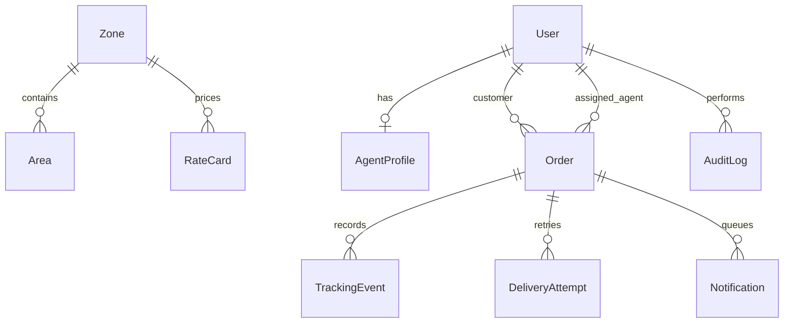

# Dispatch — Last-Mile Delivery Tracker

A production-minded delivery operations platform with configurable pricing, capacity-aware agent assignment, role-based workflows, immutable tracking, failed-delivery rescheduling, and a notification outbox.

[](https://render.com/deploy?repo=https://github.com/D-393Patel/last-mile-delivery-tracker)

## Highlights

- Customer, delivery-agent, and admin authentication and authorization
- Postal-code serviceability with configurable zones and areas
- Separate intra/inter-zone B2B and B2C rate cards
- Volumetric weight, actual-weight comparison, and configurable COD surcharge
- Quote shown before confirmation and recalculated securely on the server
- Agent ranking by zone, live Haversine distance, capacity, and workload
- Admin order filtering by status, service zone, and delivery agent
- Guarded delivery lifecycle with optimistic concurrency control
- Immutable tracking history plus admin audit log
- Failed-attempt reason, customer rescheduling, and automatic reassignment
- Email/SMS delivery through Brevo or Resend and Twilio with an outbox retry endpoint
- Responsive customer, agent, and operations dashboards
- Auto-refreshing authenticated tracking timeline
- Public tracking page with a privacy-safe API

## Stack

Next.js 16, React 19, TypeScript, PostgreSQL, Prisma, Zod, JOSE, bcrypt, and Vitest. The application is a modular monolith: one simple deployment, with business rules isolated into testable services.

## Assignment coverage

| Requirement | Implementation |
|---|---|
| Customer/admin order creation | Role-scoped booking form and API |
| Zone and rate administration | Zone, area, B2B/B2C route-rate, and COD configuration screens |
| Volumetric pricing | Server-side `(L x B x H) / 5000`, higher-weight billing, itemised quote |
| Intelligent assignment | Zone, Haversine distance, capacity, and workload ranking with manual override |
| Delivery lifecycle | Guarded agent/admin transitions with terminal-state protection |
| Immutable tracking | Append-only events recording status, timestamp, actor, message, and optional coordinates |
| Failed delivery | Required reason, numbered attempts, customer reschedule, and reassignment |
| Customer notifications | Email and SMS outbox with Brevo/Resend, Twilio, and a retry endpoint |
| Admin operations | Order search plus status, zone, and agent filters |
| Live customer tracking | Public tracking and auto-refreshing authenticated timeline |

## Quick start

Prerequisites: Node.js 20.9+ and Docker.

```bash
cp .env.example .env
docker compose up -d
npm install
npm run db:push
npm run db:seed
npm run dev
```

Open `http://localhost:3000`.

### Demo accounts

| Role | Email | Password |
|---|---|---|
| Admin | `admin@dispatch.local` | `Admin@123` |
| Agent | `agent@dispatch.local` | `Agent@123` |
| Customer | `customer@dispatch.local` | `Customer@123` |

Public demo tracking number: `LMD260630DEMO01`.

## Environment variables

| Variable | Required | Purpose |
|---|---:|---|
| `DATABASE_URL` | Yes | PostgreSQL connection string |
| `AUTH_SECRET` | Yes | At least 32 random characters used to sign sessions |
| `APP_URL` | Yes | Public application origin |
| `CRON_SECRET` | Yes | Bearer token for the notification outbox worker |
| `BREVO_API_KEY`, `BREVO_SENDER_EMAIL`, `BREVO_SENDER_NAME` | No | Domain-free email provider configuration |
| `RESEND_API_KEY`, `EMAIL_FROM` | No | Optional custom-domain email provider configuration |
| `TWILIO_ACCOUNT_SID`, `TWILIO_AUTH_TOKEN`, `TWILIO_FROM_NUMBER` | No | SMS worker provider configuration |

Never commit `.env`; `.env.example` contains safe placeholders.

## Rate calculation

1. Resolve pickup and drop postal codes to zones.
2. Select the unique `(origin zone, destination zone, B2B/B2C)` rate card.
3. Calculate volumetric kg: `(L × B × H) / 5000`.
4. Bill `max(actual kg, volumetric kg)`.
5. Freight = base rate + `ceil(max(0, billable kg − included kg)) × additional rate/kg`.
6. For COD, apply its order-type flat fee + declared-value percentage, constrained by configured minimum/maximum.

Money is stored as PostgreSQL decimals. The quote is recalculated inside order creation so a client cannot tamper with the amount.

## API overview

All bodies and responses are JSON. Authenticated routes use the HTTP-only session cookie.

| Method | Route | Role | Purpose |
|---|---|---|---|
| POST | `/api/auth/register` | Public | Register customer |
| POST | `/api/auth/login` | Public | Start session |
| POST | `/api/quote` | Any signed-in user | Calculate route charge |
| GET/POST | `/api/orders` | Scoped / Customer, Admin | List or create orders |
| GET | `/api/orders/:id` | Related user/Admin | Full order timeline |
| POST | `/api/orders/:id/assign` | Admin | Manual or automatic assignment |
| POST | `/api/orders/:id/status` | Assigned agent/Admin | Guarded status update |
| POST | `/api/orders/:id/reschedule` | Owning customer | Reschedule failed attempt |
| GET | `/api/track/:trackingNumber` | Public | Privacy-safe tracking |
| PATCH | `/api/agents/me/location` | Agent | Availability and live coordinates |
| POST | `/api/internal/notifications/process` | Worker secret | Deliver queued Resend/Twilio messages |
| GET | `/api/admin/catalog` | Admin | Zones, rates, agents, customers |
| POST | `/api/admin/rate-cards` | Admin | Upsert route pricing |
| POST | `/api/admin/cod-rules` | Admin | Upsert order-type COD pricing |
| POST | `/api/admin/zones` | Admin | Add zone and service area |
| POST | `/api/admin/areas` | Admin | Assign a postal-code area to a zone |

Errors have a stable shape: `{ "error": { "code": "...", "message": "..." } }`.

## Data model



The complete schema is in `prisma/schema.prisma`. Design rationale is in [SYSTEM_DESIGN.md](./SYSTEM_DESIGN.md) (under 800 words).

## Verification

```bash
npm run typecheck
npm test
npm run build
```

Tests focus on the evaluation-critical rules: weight/rate boundaries, COD caps, geographic distance, and permitted lifecycle transitions.

## Deployment

### Render Blueprint

1. Fork/import this repository in Render and choose **Blueprint**.
2. Render reads `render.yaml`, creates PostgreSQL and the Docker web service, and generates `AUTH_SECRET`.
3. Set `APP_URL` to the generated service URL and provide the Brevo/Twilio credentials requested by the Blueprint. A custom domain is not required: verify your existing email address as a Brevo sender.
4. The container initializes and seeds the schema before starting the web server.

Schedule a POST to `/api/internal/notifications/process` with `Authorization: Bearer <CRON_SECRET>` to drain the notification outbox. When provider variables are absent, queued messages are safely marked as skipped for local development. If both Brevo and Resend are configured, Brevo is used first.

For Vercel, connect any hosted PostgreSQL database, set the three required environment variables, run `npm run db:push && npm run db:seed` once, and deploy normally.

## Project structure

```text
app/                 Pages and API route handlers
components/          Reusable interactive UI
lib/                 Auth and domain services
prisma/              Database schema and seed
tests/               Critical business-rule tests
SYSTEM_DESIGN.md     Architecture write-up
```

## License

MIT
